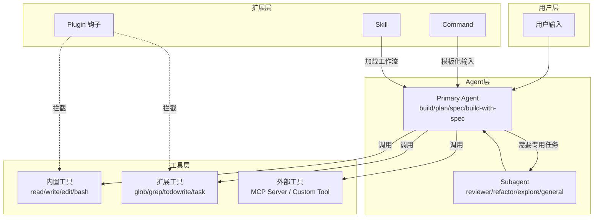
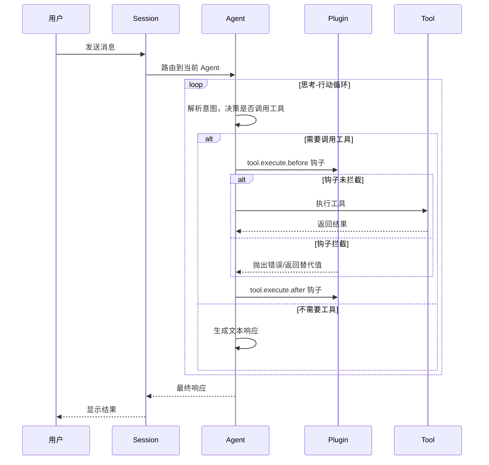
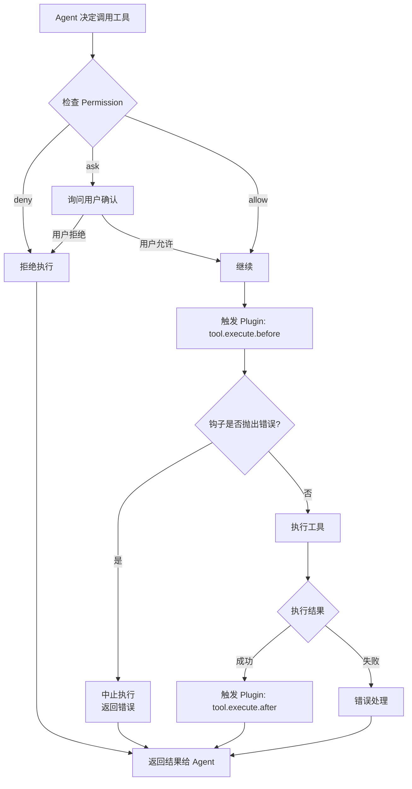
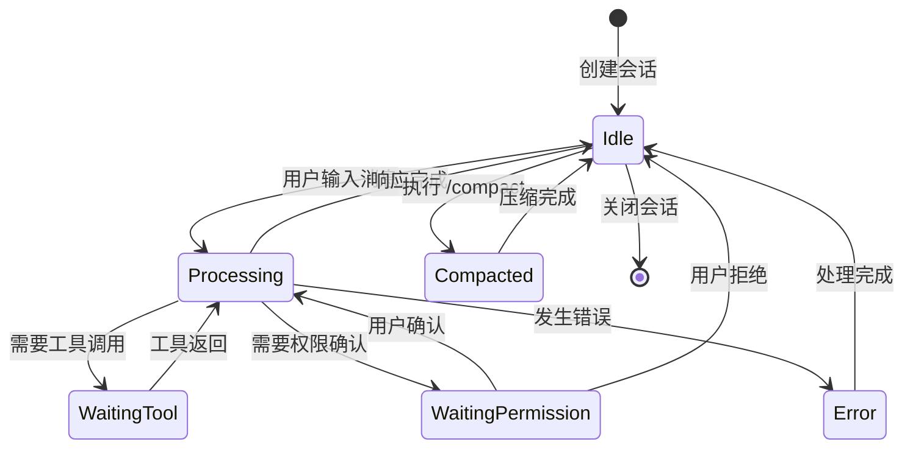
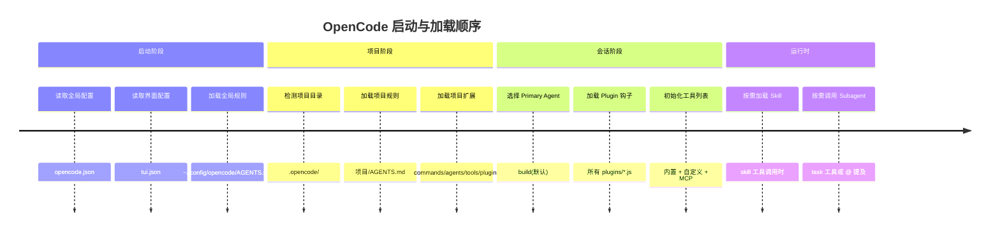
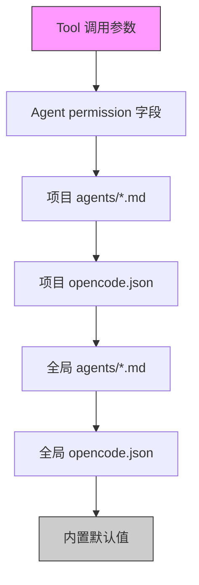
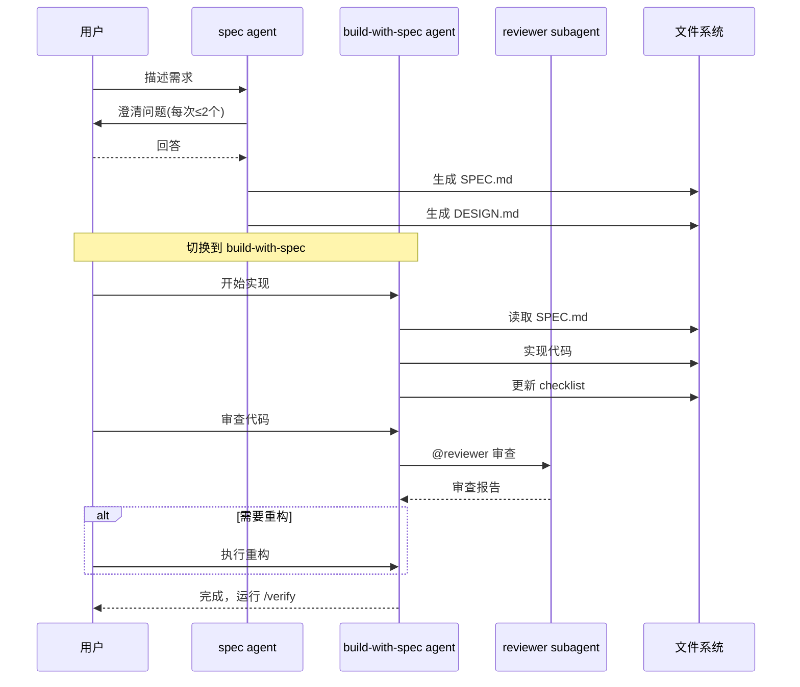

# OpenCode 快速指南

> 核心要点速查，完整文档见 https://opencode.ai/docs

---

## 1. 代理 (Agent)

### 内置代理

| 代理 | 类型 | 切换方式 | 功能 |
|------|------|----------|------|
| **build** | primary | Tab | 默认代理，全工具权限，用于开发 |
| **plan** | primary | Tab | 受限代理，编辑/bash 需确认，用于规划分析 |
| **general** | subagent | @general | 通用代理，可执行多步任务 |
| **explore** | subagent | @explore | 只读，快速探索代码库 |

**隐藏内置代理**：compaction（压缩上下文）、title（生成标题）、summary（摘要）

### 自定义代理

| 代理 | 类型 | 功能 |
|------|------|------|
| **spec** | primary | 需求分析，生成 SPEC.md → DESIGN.md → 任务清单 |
| **build-with-spec** | primary | 规格驱动开发，严格按 SPEC.md 实现 |
| **configurator** | primary | 项目定制配置生成，为封闭技术栈构建专属扩展 |
| **refactor** | subagent | 重构专用，保守渐进式策略 |
| **reviewer** | subagent | 代码审查，只读模式 |

---

## 2. 命令

| 命令 | 快捷键 | 说明 |
|------|--------|------|
| `/new` | `ctrl+x n` | 新建会话 |
| `/undo` | `ctrl+x u` | 撤销（含代码改动） |
| `/redo` | `ctrl+x r` | 重做 |
| `/sessions` | `ctrl+x l` | 历史会话 |
| `/init` | `ctrl+x i` | 初始化 AGENTS.md |
| `/models` | `ctrl+x m` | 列出模型 |
| `/compact` | `ctrl+x c` | 压缩上下文 |
| `/share` | `ctrl+x s` | 分享会话 |
| `/export` | `ctrl+x x` | 导出 Markdown |

### 自定义命令

```
/lint         # 运行 lint
/test         # 运行测试
/verify       # 验证 SPEC.md 进度
```

---

## 3. 输入技巧

```
@file.ts          引用文件（模糊搜索）
!git log -5       执行 shell，输出加入对话
@reviewer 检查代码  调用子代理
```

---

## 4. 工具权限

| 值 | 说明 |
|----|------|
| `allow` | 允许，不询问 |
| `ask` | 每次询问 |
| `deny` | 禁止 |

**常用工具**：`read`, `write`, `edit`, `bash`, `glob`, `grep`, `todowrite`, `question`, `webfetch`, `skill`, `task`

---

## 5. Spec 驱动开发工作流

```
@spec 需求描述 → SPEC.md → DESIGN.md → @build-with-spec 实现 → /verify 验证
```

**spec agent**：引导澄清需求，生成规格文档
**build-with-spec agent**：严格按 SPEC.md 实现，更新 checkbox

---

## 6. 执行生命周期

### 整体架构



### 消息处理生命周期



### 工具调用流程



### Session 状态流转



### 各组件加载时机



### 配置优先级



> 上层配置覆盖下层同名配置

### 设计决策指南

| 场景 | 推荐 | 理由 |
|------|------|------|
| 需要切换"角色"或"模式" | **Agent** | 整个会话生效，可配置权限和模型 |
| 一次性任务，有固定模板 | **Command** | 快捷触发，适合重复性操作 |
| 多步骤复杂工作流 | **Skill** | 可组合多个工具，有独立上下文 |
| 需要拦截/监控操作 | **Plugin** | 可介入执行前后，全局生效 |
| 提供单一功能 | **Tool** | 简单直接，Agent 按需调用 |
| 集成外部服务 | **MCP Server** | 标准化接口，工具化调用 |

### Agent 类型对比

| 类型 | 切换方式 | 可用代理 | 特点 |
|------|----------|----------|------|
| **Primary** | Tab 切换 | build, plan, spec, build-with-spec, configurator | 主代理，处理用户对话，可配置权限 |
| **Subagent** | @ 调用 | reviewer, refactor, explorer, general | 专用代理，由主代理调用，专注单一任务 |

### 典型工作流示例

**规格驱动开发完整流程**



---

## 7. 自定义扩展

| 类型 | 位置 | 格式 | 说明 |
|------|------|------|------|
| Rules | `AGENTS.md` | Markdown | 规则/提示词 |
| Commands | `commands/*.md` | Markdown | 斜杠命令 |
| Agents | `agents/*.md` | Markdown | 专用代理 |
| Skills | `skills/*/SKILL.md` | Markdown | 复杂工作流 |
| Tools | `tools/*.ts` | TypeScript | 自定义函数 |
| Plugins | `plugins/*.js` | JavaScript | 事件钩子 |

**作用域**：`~/.config/opencode/` 全局，`项目/.opencode/` 项目级

### Agent 定义示例

```markdown
---
description: Agent 描述
mode: primary        # primary(Tab切换) | subagent(@调用)
model: xxx           # 可选
temperature: 0.1     # 可选
permission:          # 可选
  edit: deny
  bash:
    "*": ask
    "git status": allow
---

系统提示词内容
```

### 自动生效的插件

| 插件 | 功能 |
|------|------|
| **env-protection** | 拦截读取/提交敏感文件（.env, .key 等） |
| **pkg-manager-guard** | 检测并拦截包管理器混用 |
| **circuit-breaker** | 连续失败 2 次后熔断，显示剩余冷却时间 |
| **spec-workflow** | 检测 SPEC.md，显示待完成任务列表 |

---

## 快速参考

```
Tab           切换 primary agent (build/plan/spec/build-with-spec/configurator)
ctrl+x n      新建会话
ctrl+x u/r    撤销/重做
ctrl+x l      历史会话
@file         引用文件
@agent        调用 subagent (reviewer/refactor/explore/general)
/command      执行命令
!cmd          shell 命令
```

---

## 待探索功能

### 多模态自动路由

**场景**：GLM-5 等模型推理能力强但不支持多模态，无法理解用户发送的图片。

**思路**：
```
用户输入 [文本 + 图片]
         ↓
Plugin 拦截消息
         ↓
Gemini Flash 理解图片 → 转文本描述
         ↓
GLM-5 处理纯文本
```

**技术方案**：
1. 配置模型时声明 `modalities.input: ["text", "image"]`（假多模态）
2. Plugin 拦截 `experimental.chat.messages.transform` 钩子
3. 检测图片 → 调用多模态模型 → 替换为文本

**待验证**：
- `experimental.chat.messages.transform` 是否稳定可用
- 在钩子内调用其他模型是否会造成死循环
- 实际效果是否流畅自然
